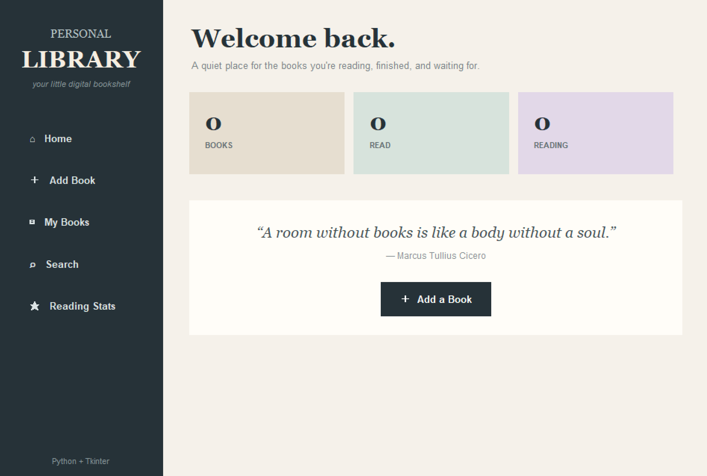

# Personal Library Manager

> A simple desktop library app made with Python and Tkinter.

## About

Personal Library Manager is a small application for keeping track of books in one place.

Books can be added with their title, author, genre, rating, and reading status. The app also includes search and reading statistics.

## Preview

  

## Features

- Add books
- Store author and genre
- Add a rating from 1 to 5
- Set reading status
- View all books
- Search by title, author, or genre
- Remove books
- View reading statistics
- Track reading progress
- Simple desktop interface

## Built With

- Python
- Tkinter

No external libraries are required.

## What I'm Learning

This project helped me practice:

- Classes and objects
- Lists
- Dictionaries
- Functions
- Loops
- Conditions
- Searching through data
- Adding and removing data
- Input validation
- Tkinter widgets
- Buttons and events
- Building a multi-screen GUI
- Basic data management

## How It Works

    Add Book
        ↓
    Store Book Details
        ↓
    View Library
        ↓
    Search / Remove Books
        ↓
    Track Reading Progress

## How to Run

Make sure Python is installed.

Run:

    python personal_library.py

## Project Structure

    personal-library-manager/
    │
    ├── personal_library.py
    ├── README.md
    ├── personal-library-manager.png

## Goal

I made this project to practice working with collections, functions, basic OOP, and GUI development while building something useful around one of my interests.

---

read more. build more.

